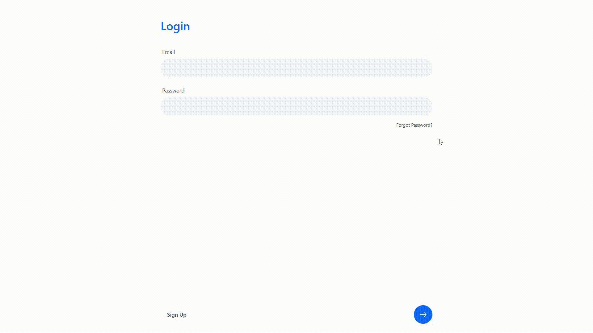
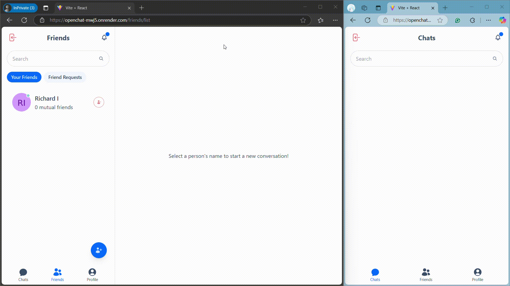
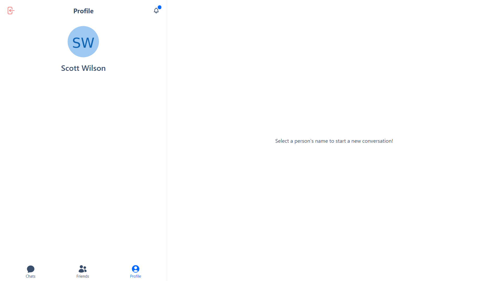
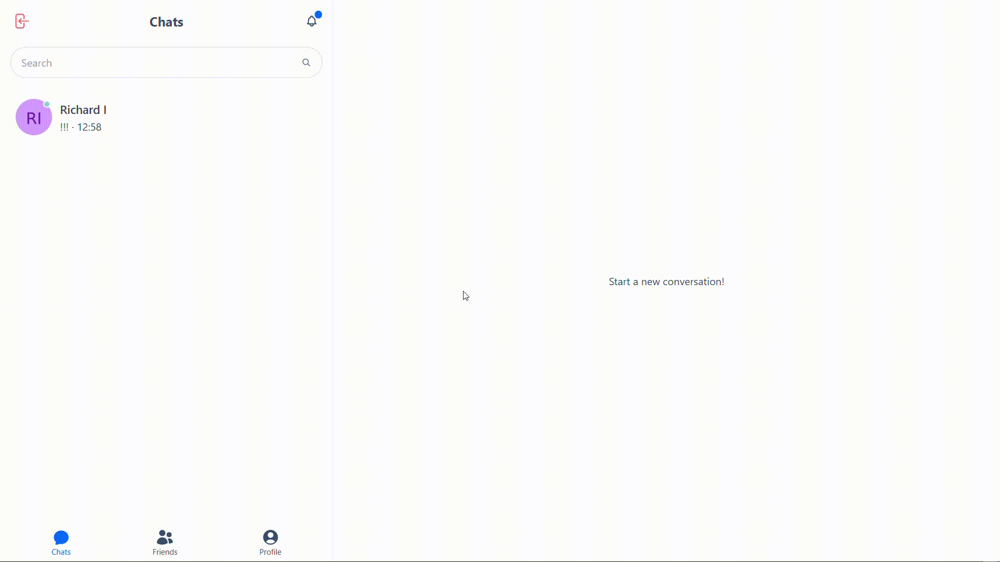

# OpenChat

"OpenChat" is a simple real-time chat website using socket.io

## Features

- Login and Sign up.
- Chats Page for sending and receiving messages with friends in real-time.
- Friends Page to add new friends, manage friend requests, and view your friends list.
- Profile Page that displays your name and profile picture for personalization.
- Search for Conversations to find past chats quickly.
- Search for friends you want to connect with and send friend requests.
- Logout.

## Manual

### Login and Sign up Page

### Chats Page

### Friends Page

### Profile Page

### Logout

## Tech Stack

- React
- Tailwind CSS
- DaisyUI
- Express.js
- MongoDB
- Sockect.io

